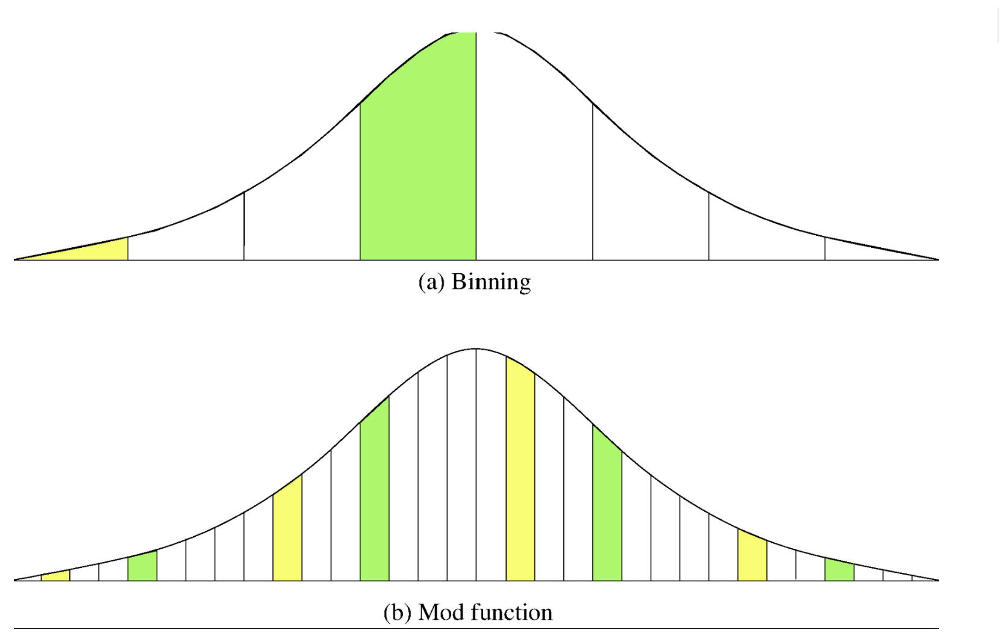

# [6주차] 분산컴퓨팅

**Consistent Hashing**



일반적인 해시 분산 방식에서는 서버가 추가되거나 제거되면 거의 모든 데이터의 위치가 바뀌게 된다.

예를 들어 서버가 3대일 때와 4대일 때 해시 mod 값이 달라지기 때문에 대부분의 데이터가 다른 서버로 이동한다. 이는 대규모 시스템에서는 치명적인 문제다. 데이터 이동 비용이 너무 크기 때문이다.


onsistent Hashing은 이런 문제를 해결하기 위해 설계된 방법으로, 서버 수가 변해도 전체 데이터 중 일부만 이동하도록 만든다. 

핵심 아이디어는 데이터를 서버 번호가 아니라 “해시 링(hash ring)”이라는 원형 공간 위에 배치하는 것이다. 서버와 데이터 모두 같은 해시 함수로 원 위의 위치에 놓이고, 각 데이터는 자신보다 시계 방향으로 가장 먼저 만나는 서버에 저장된다.

```
데이터 key 생성
      ↓
hash(key) 계산
      ↓
해시 링 위치 결정
      ↓
시계 방향으로 첫 서버 찾기
      ↓
그 서버에 저장
```


특징은 서버가 추가되거나 제거될 때 영향 범위가 제한된다는 점이다. 

예를 들어 서버 하나가 새로 들어오면 그 서버 위치 바로 뒤에 있던 데이터들만 새 서버로 이동한다. 나머지 데이터는 그대로 유지된다. 따라서 전체 데이터 이동 비율이 크게 줄어든다.

**Virtual Node**


 단순한 최적화 기법이 아니라, 실제 분산 시스템에서 Consistent Hashing을 제대로 쓰기 위해 거의 필수적으로 사용되는 핵심 구조다.

Consistent Hashing의 기본 아이디어는 서버와 데이터를 동일한 해시 공간에 배치하고, 각 데이터는 자신보다 시계 방향으로 가장 먼저 만나는 서버에 저장되는 방식이다. 이 방식의 장점은 서버가 추가되거나 제거될 때 전체 데이터가 아니라 일부 데이터만 이동한다는 점이다. 하지만 기본 구조 그대로 사용하면 한 가지 문제가 발생한다.

**서버마다 담당하는 데이터 양이 균등하지 않을 수 있다.**

그 이유는 서버 위치가 해시값에 의해 결정되기 때문이다. 해시 함수는 균등 분포를 목표로 하지만 실제 결과는 완전히 균등하지 않다. 만약 특정 서버가 링에서 넓은 구간을 차지하게 되면 그 서버는 과도한 데이터를 맡게 되고, 반대로 어떤 서버는 거의 데이터를 받지 못할 수도 있다. 이런 상황은 분산 시스템에서 치명적이다. 일부 서버만 과부하가 걸리고 나머지는 놀게 되기 때문이다.

이 문제를 해결하는 방법이 **Virtual Node**다.

하나의 실제 서버를 링 위에 여러 개의 가상 위치로 배치한다.

즉 서버 1대를 링 위에 1번만 놓는 게 아니라 여러 번 등장시키는 것이다. 이렇게 하면 각 서버는 링의 여러 구간을 나눠 맡게 되고, 결과적으로 데이터 분포가 훨씬 균등해진다.

예를 들어 실제 서버가 3대 있고 각 서버마다 가상 노드를 100개씩 만든다면, 링 위에는 총 300개의 노드가 존재하게 된다. 이때 데이터는 300개 위치 중 하나에 매핑되고, 각 서버는 그중 100개의 위치를 담당하게 된다. 이렇게 하면 특정 서버가 넓은 구간을 독점하는 상황이 거의 발생하지 않는다.

```
서버 등록
→ 서버마다 여러 개의 virtual node 생성
→ 각 virtual node를 링 위에 배치
→ 데이터 key 해싱
→ 시계 방향 첫 virtual node 찾기
→ 해당 virtual node가 속한 실제 서버에 저장
```